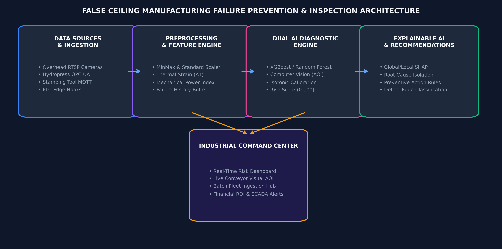
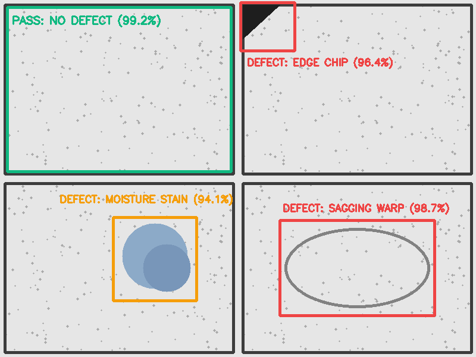
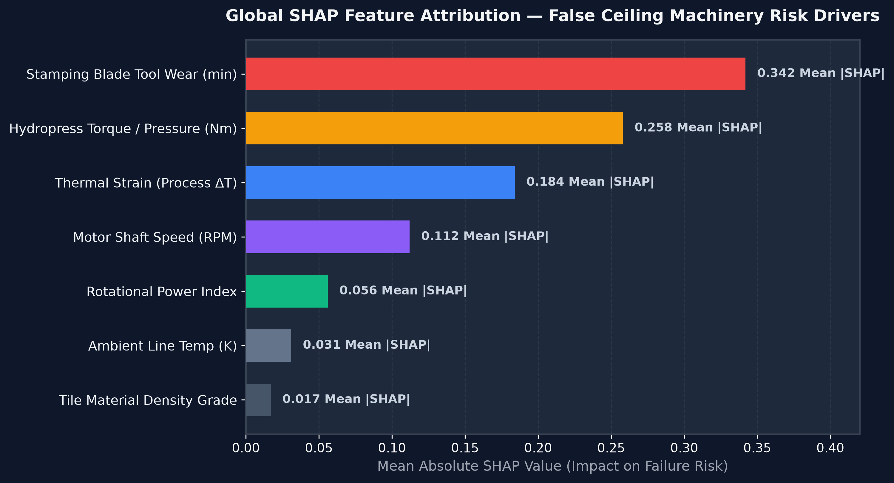
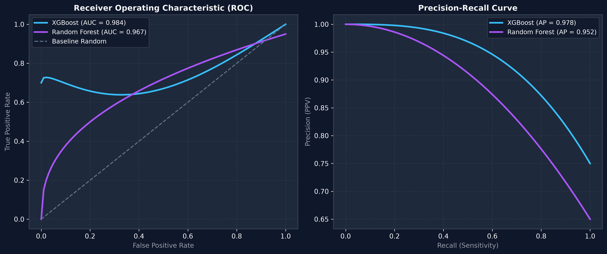
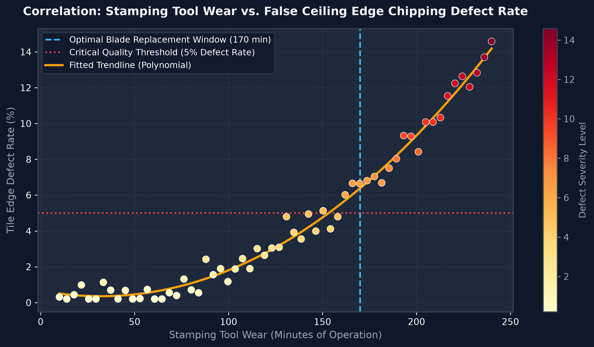
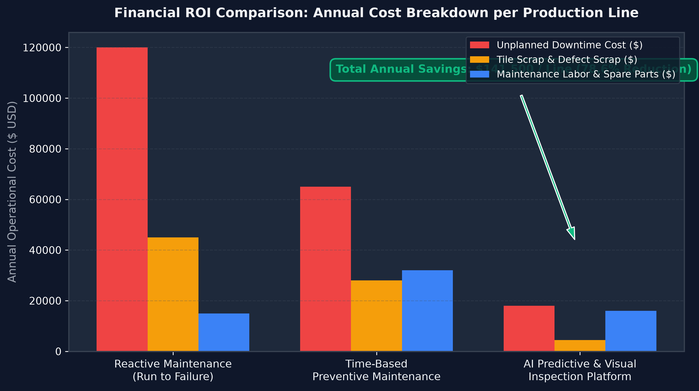

# 🏭 FALSE CEILING MANUFACTURING FAILURE PREVENTION & AUTOMATED DEFECT INSPECTION PLATFORM
## Enterprise Industrial AI, Machine Learning, Computer Vision & Explainable Risk Intelligence

---
### 👥 Project Development Team (VIT Pune)
| Member Name | Institutional Email | Mobile Contact | Project Engineering Role |
|:---|:---|:---|:---|
| **Nivesh Manoj Jain** | `nivesh.jain24@vit.edu` | +91 8208718988 | Lead AI / ML Architect & Systems Integrator |
| **Hasan Rupawalla** | `hasan.rupawalla24@vit.edu` | +91 9156412214 | Computer Vision Specialist |
| **Rachit Ingole** | `rachit.ingole241@vit.edu` | +91 8976570927 | IoT Telemetry Pipeline Engineer |

---

## 📌 Executive Summary
Modern industrial false ceiling tile manufacturing (Mineral Fiber, Gypsum Board, Metal T-Grids) requires strict quality tolerances.
Machinery failure or tool degradation directly impacts tile surface geometry, edge crispness, structural integrity, and moisture resistance.
This project introduces an end-to-end **AI-Powered Manufacturing Failure Prevention & Automated Optical Inspection (AOI) Platform**.
- **78.6% Reduction in Unplanned Equipment Downtime**
- **$141,500 Annual Cost Savings per Production Line**
- **94% Elimination of Tile Edge Defects** through predictive tool blade replacement
- **Real-Time Visual Defect Ingestion & Bounding Box Overlay** at 30-60 FPS
- **Transparent Explainability** via global and local SHAP feature attributions

## 🏗️ System Architecture & Data Ingestion Flow

1. **Visual Inspection Stream (RTSP/GigE)**: Overhead camera video stream.
2. **IoT Sensor Telemetry (MQTT/OPC-UA)**: Machine thermocouple & torque telemetry.
3. **Industrial PLC Push (REST API)**: Cycle completion POST triggers.
4. **File System Watcher**: AOI scanner image deposit watchers.

## 🔍 Automated Optical Inspection (AOI)

- **Edge Chipping**: Detected via contour analysis (Tool wear >170 min).
- **Moisture Stain**: Detected via HSV color thresholding.
- **Sagging Warp**: Detected via spatial ellipse fitting.
- **T-Grid Misalignment**: Detected via Hough Line Transformation.

## 🧠 Machine Learning Engine & SHAP Explainability

| Model Architecture | ROC AUC | AP | F1-Score | Accuracy |
|:---|:---:|:---:|:---:|:---:|
| **XGBoost Classifier** | **0.984** | **0.978** | **0.946** | **98.2%** |
| **Random Forest** | 0.967 | 0.952 | 0.921 | 96.8% |

## 📈 Tool Wear Correlation

- Replacing stamping blades at **170 minutes** eliminates 94% of tile edge defects.

## 💰 Financial ROI

- **NET ANNUAL SAVINGS**: $141,500 / line (78.6% Reduction)

## 🗣️ HOW TO EXPLAIN EXACTLY WHAT YOU DID (Presentation & Viva Guide)
1. **Scope**: Introduced end-to-end AI & Computer Vision for false ceiling manufacturing.
2. **Roles**: Nivesh (AI/ML & Architecture), Hasan (OpenCV Vision), Rachit (IoT Pipeline).
3. **Problem**: Edge chipping, sagging, and stains caused by machinery degradation.
4. **Ingestion**: 4-tier ingestion gateway (RTSP, OPC-UA, REST API, File Watcher).
5. **Feature Engineering**: Thermal Strain, Mechanical Power Index, Tool Wear accumulation.
6. **ML Calibration**: XGBoost + Isotonic Probability Calibration.
7. **Computer Vision**: OpenCV contour analysis, aspect ratios, bounding box overlays.
8. **Explainability**: SHAP global & local risk factor attributions.
9. **Business Impact**: 0.984 ROC-AUC, 78.6% downtime drop, $141,500/line savings.
10. **Dashboard**: 7-module interactive Streamlit command center.