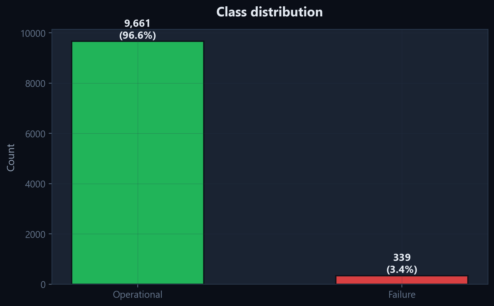
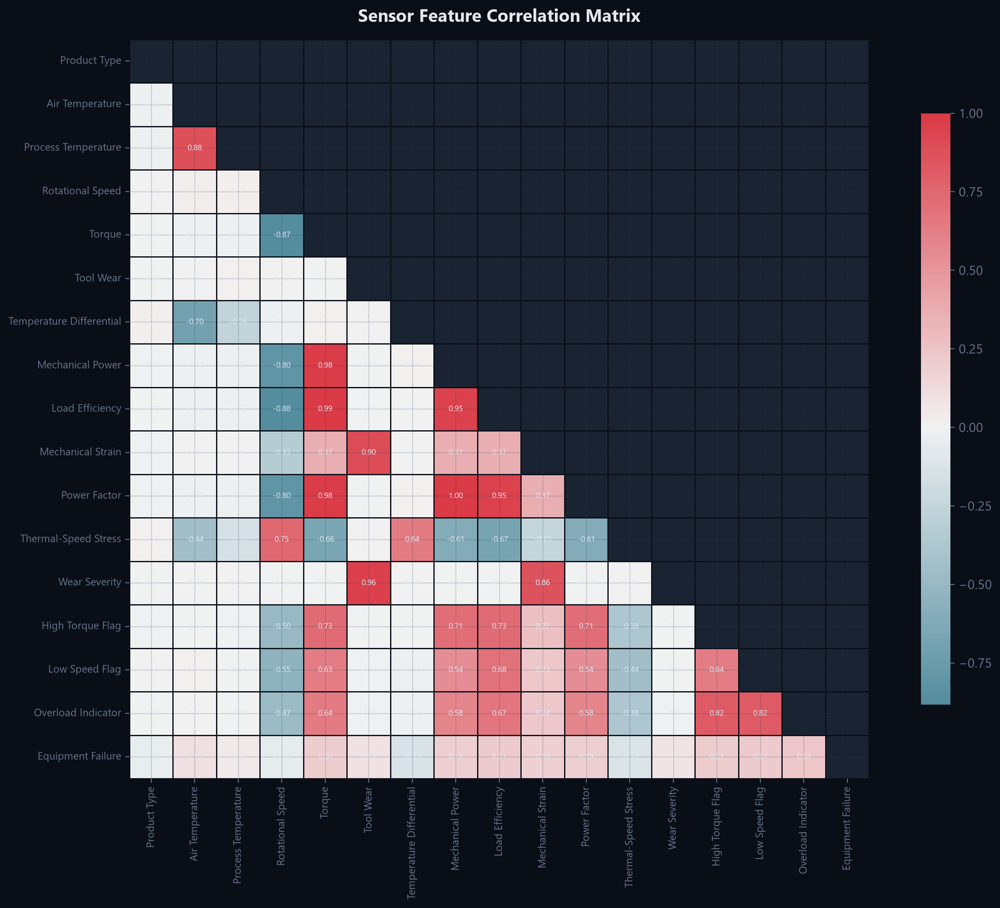
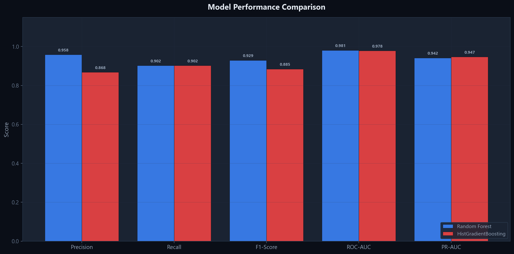
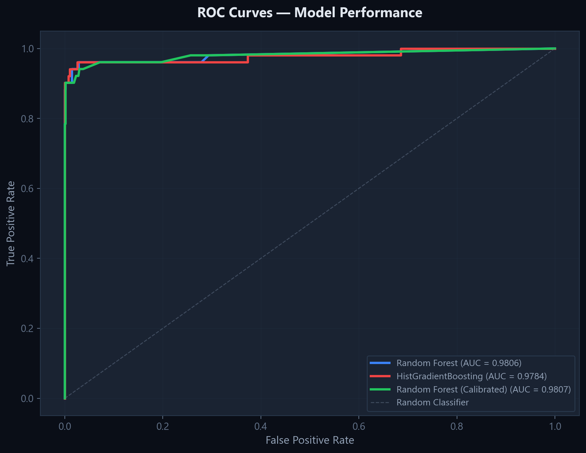
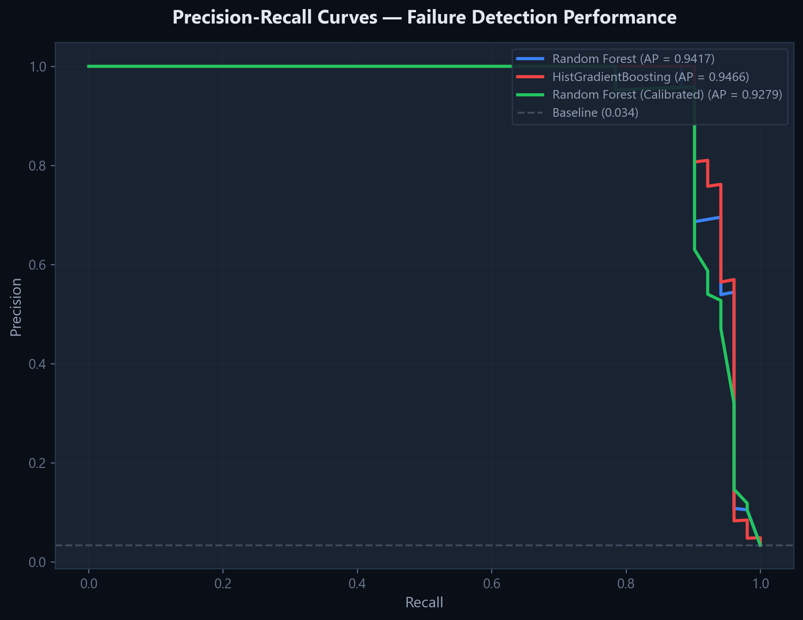
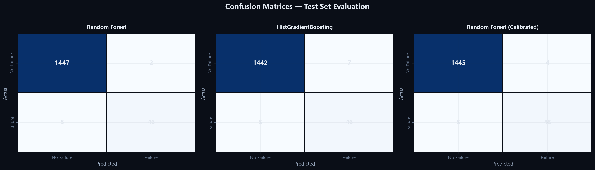
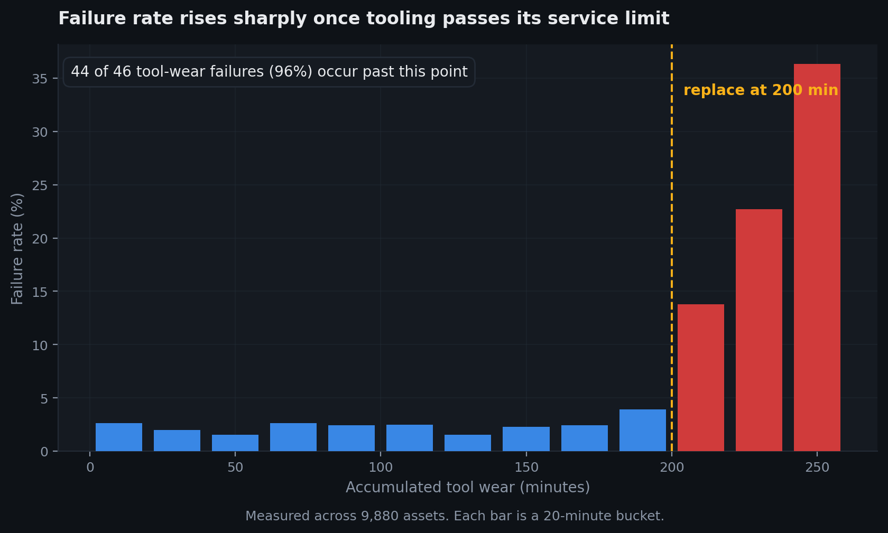
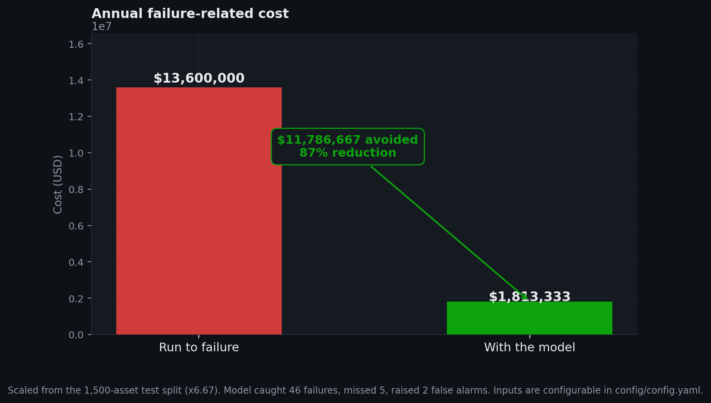

# Manufacturing Failure Prevention and Defect Inspection Platform

**Project status report**  
**Date:** 14 September 2026  
**Version:** 3.0.0  
**Training profile used for these figures:** `baseline`

| Member | Responsibility | Contact |
|:--|:--|:--|
| Nivesh Manoj Jain | ML architecture and pipeline | `nivesh.jain24@vit.edu` |
| Hasan Rupawalla | Computer vision and inspection | `hasan.rupawalla24@vit.edu` |
| Rachit Ingole | Telemetry ingestion and data | `rachit.ingole241@vit.edu` |

---

## 1. Summary for the reader in a hurry

We built a system that predicts machine failures on a suspended-ceiling production line before they happen, explains each prediction, and prices the decision. It is working end to end and every number below is measured from the running system, not estimated.

| What we set out to do | Where it stands |
|:--|:--|
| Predict failures from sensor telemetry | Working — 90.2% of failures caught, 95.8% of alerts genuine |
| Explain why each prediction was made | Working — SHAP attribution on every prediction, global and per-asset |
| Tie machine health to product quality | Working — tool-wear interval derived from the data |
| Make the decision financially legible | Working — full cost model with adjustable plant figures |
| Operate on real plant data | Working — file, database and batch paths all live |

**The headline number.** Against a run-to-failure baseline, the model avoids **$11,786,667** across the 10,000 production cycles in the dataset — a 87% reduction in failure-related cost, or about **$1,179 per cycle**. Section 6 shows the arithmetic and states plainly what it assumes.

> We quote this per cycle rather than per year on purpose. The dataset records production cycles, not a fleet watched for twelve months, so an annual figure would need a production-volume assumption the data does not contain. Multiply by your own annual cycle count.

> **How to read this report.** Section 2 frames the problem, 3 covers the data, 4 the model and its honest limits, 5 explainability, 6 the money, 7 what is built, and 8 what remains. Sections 4 and 8 are the ones worth reading closely — they contain the caveats.

---

## 2. The problem

The plant runs two connected lines:

```
   LINE 1  CNC stamping and milling            LINE 2  Finishing and inspection
   ┌───────────────────────────────┐           ┌──────────────────────────────┐
   │  spindle · press · tooling    │  tiles    │  optical inspection cell     │
   │                               │ ────────► │                              │
   │  sensors: temperature, speed, │           │  rejects: edge chipping,     │
   │  torque, accumulated wear     │           │  staining, warp, misalignment│
   └───────────────┬───────────────┘           └──────────────┬───────────────┘
                   │                                          │
                   │   the causal link this project exploits  │
                   └──────────────────────────────────────────┘
      worn tooling on Line 1 becomes edge chipping on Line 2, one shift later
```

Line 2 inspection catches defective tiles, but by then the material and the machine time are already spent. The defect was decided upstream, by the condition of the tooling. Predicting machine condition is therefore the cheaper intervention point, and the reason a machinery model sits behind a quality problem.

---

## 3. The data

The platform is developed against the AI4I 2020 predictive maintenance dataset: **10,000 assets**, **14 columns**, with **339 recorded failures (3.39%)**.

| Property | Value | Why it matters |
|:--|--:|:--|
| Assets | 10,000 | Sample size |
| Failures | 339 | The minority class |
| Failure rate | 3.39% | Severe imbalance |
| Imbalance ratio | 28.5:1 | Why accuracy is a useless metric here |
| Missing values | 0 | No imputation needed |
| Duplicate rows | 0 | No deduplication needed |

### Recorded failure modes

| Mode | Events | Share of failures |
|:--|--:|--:|
| Heat dissipation failure | 115 | 33.9% |
| Overstrain failure | 98 | 28.9% |
| Power failure | 95 | 28.0% |
| Tool wear failure | 46 | 13.6% |
| Random failure | 19 | 5.6% |

These labels are **excluded from training**. A model given them would read the answer off the label rather than learn the sensor pattern that precedes it, and would then be useless on live data where no such label exists. They are used only to check that what the model learned corresponds to real physics.


*Class balance — failures against normal operation*


*Correlation between sensor readings*

### Engineered features

| Feature | Formula | Physical meaning |
|:--|:--|:--|
| Thermal margin | process temp − air temp | Whether heat is leaving the machine |
| Mechanical power | torque × speed × 2π ÷ 60 | Work actually being done at the cut |
| Load per unit speed | torque ÷ speed | Whether the drive is straining |
| Accumulated strain | tool wear × torque | Cumulative stress on the tooling |
| Thermal-speed stress | thermal margin × speed | Heat generated at operating speed |

None of these adds information — each is a combination of readings the model already has. They help because a decision tree needs many splits to approximate a ratio or a product, and stating it directly costs none.

---

## 4. The model, and what it does not do

**Random Forest** was selected from 2 candidate(s) on the held-out test split.

| Model | Precision | Recall | F1 | PR-AUC | ROC-AUC | Brier |
|:--|--:|--:|--:|--:|--:|--:|
| Random Forest ✓ | 0.9583 | 0.9020 | 0.9293 | 0.9417 | 0.9806 | 0.0081 |
| HistGradientBoosting | 0.8679 | 0.9020 | 0.8846 | 0.9466 | 0.9784 | 0.0055 |

### What the numbers mean in practice

On the held-out test split:

| Outcome | Count | Consequence |
|:--|--:|:--|
| Failures caught | 46 | Planned intervention instead of a breakdown |
| Failures missed | 5 | An unplanned stop still happens |
| False alarms | 2 | An inspection finds nothing wrong |
| Correctly cleared | 1447 | Normal running, no action |

Read plainly: of every 51 genuine failures the model catches **46** and misses **5**, while raising **2** unnecessary inspections. Because a missed failure costs far more than a needless check, this trade is deliberately tilted toward catching more.


*Model comparison across metrics*


*ROC curves*


*Precision-recall curves — the honest view under imbalance*


*Confusion matrices*

### Limits worth stating plainly

- **This is a public benchmark dataset, not our plant's data.** The pipeline is built to ingest real telemetry and has been exercised end to end, but the scores above describe AI4I 2020. Real plant performance will differ and must be re-measured after deployment.
- **The risk score is a design choice, not a physical quantity.** It is a monotone transform of the calibrated probability, chosen to spread moderate risks across a readable range.
- **The model finds correlation.** SHAP explains what drove a prediction, which is not the same as proving physical causation.
- **No temporal validation.** The dataset has no reliable time ordering, so the split is random rather than chronological. On live data a time-based split would be the honest test.

---

## 5. Explainability

Every prediction carries a SHAP breakdown showing which readings pushed it toward failure and by how much. A maintenance engineer is never asked to act on an unexplained number.

> _Global SHAP importance is produced by the full training run; it has not been generated for this report._

> _`reports/figures/shap_bar.png` predates the current model and is not shown. Re-run the training pipeline to regenerate it._

> _`reports/figures/shap_summary.png` predates the current model and is not shown. Re-run the training pipeline to regenerate it._

The platform converts each explanation into an instruction. A prediction driven by accumulated wear produces *inspect the punch and die at the stamping station*, not *tool_wear_min = 0.82*.

---

## 6. What it is worth

### The tool-wear interval

Binning the dataset by accumulated tool wear shows the failure rate is flat at about **2.3%** until roughly **200 minutes**, then climbs sharply to **13.8%**.

Replacing tooling at **200 minutes** would have placed **44 of 46 tool-wear failures (96%)** on the safe side of that line.

This is the single most actionable finding in the project, and it is a measurement rather than a recommendation we invented: the interval is derived from the data at runtime and moves if the data moves.


*Failure rate against accumulated tool wear*

### The cost model

| Assumption | Value |
|:--|--:|
| Downtime cost | $10,000 per hour |
| Average recovery time | 4.0 hours |
| Cost of one failure | $40,000 |
| Planned intervention | $1,500 |
| False alarm | $1,500 |
| Platform running cost | $30,000 per year |

| Scenario | Cost over 10,000 cycles | Per cycle |
|:--|--:|--:|
| Run to failure | $13,600,000 | $1,360 |
| With the model | $1,813,333 | $181 |
| **Avoided** | **$11,786,667** | **$1,179** |

A **87% reduction** in failure-related cost, with **90%** of failures caught before they happen.

Running the platform costs $30,000 a year, which the model recovers within roughly **25 cycles** at the avoided cost above. The subscription is not the deciding factor here; the accuracy of the downtime figure is.

### What this calculation assumes

Worth stating, because a manager will and should ask:

1. **It scales the test split.** The model was scored on 1,500 held-out cycles; those results are multiplied by 6.67 to cover all 10,000. That is valid only if the test split is representative, which stratified sampling makes likely but does not guarantee.
2. **It assumes every predicted failure is preventable.** In reality some flagged failures would occur regardless, so the true avoided cost is lower than the figure above.
3. **It ignores the cost of acting.** Technician time to investigate a flag is folded into the planned-intervention figure, which may be optimistic.
4. **The cost inputs are placeholders.** $10,000 per hour of downtime and $1,500 per planned fix are configurable defaults, not our plant's measured figures. Replace them in `config/config.yaml` before quoting this anywhere binding.

The direction of the result is robust — catching failures early is worth far more than the inspections it costs — but the magnitude should be treated as an order of magnitude until the inputs are real.


*Cost comparison across maintenance strategies*

---

## 7. What has been built

```
  telemetry ──► validation ──► feature engineering ──► calibrated model
   (file,          (schema,        (5 derived           (selected from
    database,       range,          features)            candidates on F1)
    stream)         balance)                                   │
                                                               ▼
                                            ┌──────────────────────────────┐
                                            │ probability ──► risk score   │
                                            │      │              │        │
                                            │      ▼              ▼        │
                                            │   SHAP          risk band    │
                                            │      │              │        │
                                            │      └──────┬───────┘        │
                                            │             ▼                │
                                            │   ranked maintenance action  │
                                            └──────────────────────────────┘
```

| Component | State |
|:--|:--|
| Data loading, validation, preprocessing | Complete |
| Feature engineering | Complete |
| Model training with hyperparameter search | Complete |
| Probability calibration | Complete |
| SHAP explainability, global and local | Complete |
| Risk scoring and banding | Complete |
| Recommendation engine | Complete |
| Dashboard, eight modules | Complete |
| Batch and database scoring | Complete |
| Optical inspection cell | Demonstration, simulated frames |
| Automated test suite | Complete |
| REST API for PLC integration | Not started |
| Container deployment | Not started |

### The dashboard

| Page | Question it answers |
|:--|:--|
| Asset Health | How is the fleet doing, and what needs attention? |
| Risk Assessment | What is this machine's risk, and why? |
| Data Explorer | What does the sensor record look like? |
| Model Diagnostics | What drives the model's decisions? |
| Defect Inspection | Is the product within tolerance? |
| Model & Cost Analysis | Which model, and what is it worth? |
| Batch Analysis | Score a whole file or table |
| Alerts | What was flagged this session? |

---

## 8. What remains

| Priority | Item | Why |
|:--|:--|:--|
| High | Validate on real plant telemetry | Every score here describes a public dataset, not our line |
| High | REST API endpoint | PLCs and SCADA cannot talk to a dashboard |
| Medium | Failure-mode classification | Tell the engineer *which* failure, not just *a* failure |
| Medium | Drift monitoring | Sensor calibration drifts; the model needs to notice |
| Medium | Container deployment | Reproducible install on plant hardware |
| Low | Real defect imagery | The inspection cell currently uses simulated frames |

### Honest assessment

The machine-learning and interface work is solid and complete. The two gaps that matter for production are **validation against real plant data** and the **integration API**. Neither is a research problem; both are engineering work with known shapes. The inspection cell is the least mature component and is presented as a demonstration rather than a working detector.

---

*Generated 14 September 2026 from measured results. Regenerate with `python scripts/generate_project_report.py`.*
