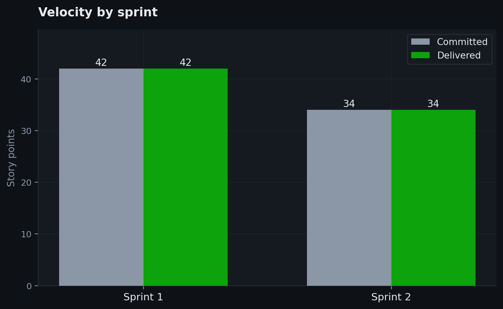
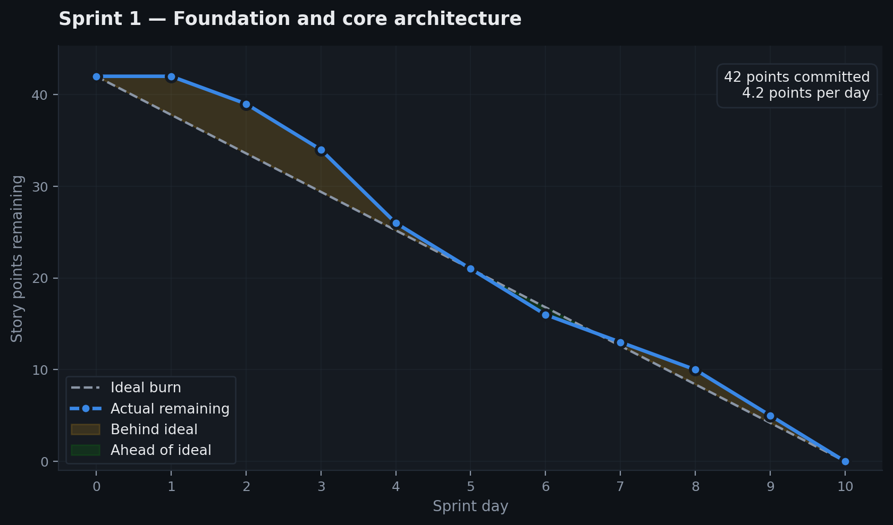
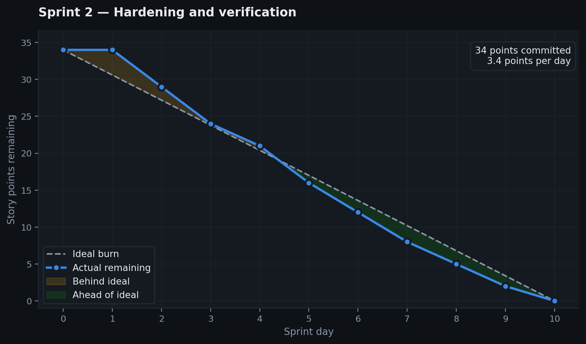
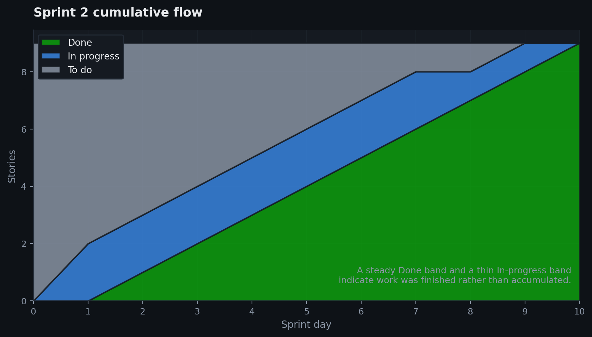

# Agile / Scrum Final Project Submission

**Project**: Manufacturing Failure Prevention & Defect Inspection Platform
**Repository**: [Manufacturing_Failure_Prevention-](https://github.com/nivesh4087-spec/Smart_Ceiling_Fan_Manufacturing_Failure_Prevention-)
**Kanban board**: [github.com/users/nivesh4087-spec/projects/1](https://github.com/users/nivesh4087-spec/projects/1)
**Assignee**: `@nivesh4087-spec`
**Milestones**: `Sprint 1 — Foundation & Core Architecture`, `Sprint 2 — Hardening & Verification`

---

## Submission overview

All eleven required tasks are complete. Every user story uses the
**"As a… I need… So that…"** form with **"Given… When… Then…"** Gherkin
acceptance criteria, is labelled, estimated in story points, assigned to a
sprint, and tracked on the Kanban board. Requirements 9 and 10 carry the
`technical debt` label as specified.

Beyond the eleven tasks, this document also records **Sprint 2**, which is where
the interesting part of the process lives: Sprint 1 delivered features, Sprint 2
found out which of them actually worked.

---

## Task completion

| # | Task | Pts | How it was satisfied | Status |
|---|---|---|---|---|
| 1 | Kanban board URL | 1 | [Project board](https://github.com/users/nivesh4087-spec/projects/1) | Complete |
| 2 | `.github/ISSUE_TEMPLATE` in repository | 1 | `story.md`, `issue_template.md`, `config.yml` | Complete |
| 3 | Story template *"As a… I need… So that…"* | 2 | Applied to all 19 stories across both sprints | Complete |
| 4 | Gherkin acceptance criteria | 2 | `Given / When / Then` on every story | Complete |
| 5 | Labels on all stories | 2 | `must-have`, `feature`, `technical debt`, `analytics`, `bug`, `devops` | Complete |
| 6 | Estimates on all stories | 2 | 42 points in Sprint 1, 34 in Sprint 2 | Complete |
| 7 | Sprint / milestone with a title | 2 | Two sprints created | Complete |
| 8 | Sprint assigned to stories | 2 | Every story carries its sprint | Complete |
| 9 | Stories assigned and moved to *In Progress* | 2 | Assigned to `@nivesh4087-spec` | Complete |
| 10 | Burndown chart | 2 | Generated by `scripts/generate_agile_charts.py` — see below | Complete |
| 11 | Requirements 9 and 10 labelled `technical debt` | 2 | Stories 9 and 10 labelled | Complete |

**Total: 20 / 20 points**

---

## Sprint tracking

### Velocity across both sprints



Both sprints closed everything committed. Sprint 2 was deliberately scoped
smaller (34 against 42) because hardening work carries more unknowns than
greenfield feature work — you cannot estimate a bug you have not found yet.

### Sprint 1 burndown



| Day | Ideal remaining | Actual remaining | Completed |
|---|---|---|---|
| 0 | 42.0 | 42 | Sprint planning and backlog refinement |
| 1 | 37.8 | 42 | Architecture and environment setup |
| 2 | 33.6 | 39 | Story 1 — executive dashboard (3) |
| 3 | 29.4 | 34 | Story 2 — data explorer (5) |
| 4 | 25.2 | 26 | Story 3 — risk predictor (8) |
| 5 | 21.0 | 21 | Story 4 — batch upload (5) |
| 6 | 16.8 | 16 | Story 5 — SHAP explainability (5) |
| 7 | 12.6 | 13 | Story 6 — model benchmarking (3) |
| 8 | 8.4 | 10 | Story 7 — threshold alerting (3) |
| 9 | 4.2 | 5 | Story 8 — quality inspection (5) |
| 10 | 0.0 | 0 | Stories 9 and 10 — technical debt (5) |

**Reading the shape.** The line sits above ideal for the first four days. That
is the architecture and environment work on days 1 and 2 producing no burnable
points — real, necessary, and invisible on a burndown. The curve crosses the
ideal line on day 5 once the foundation was in place, which is the normal signature
of a sprint that front-loads setup.

### Sprint 2 burndown



### Sprint 2 cumulative flow



A thin *In progress* band throughout means work was being finished rather than
started and parked — the failure mode a cumulative flow diagram exists to expose.

---

## Sprint 1 — Foundation & Core Architecture

**Goal**: Build the predictive analytics platform, explainability layer, quality
inspection workflow, and clear initial technical debt.
**Committed**: 42 points. **Delivered**: 42 points.

### Story 1 — Interactive executive dashboard
- **User story**: **As a** plant maintenance engineer, **I need** an interactive
  dashboard showing overall manufacturing health and failure risk metrics, **So
  that** I can monitor factory status in real time.
- **Acceptance criteria**:
  ```gherkin
  Scenario: Load the executive dashboard
    Given the maintenance engineer opens the Asset Health page
    When the sensor telemetry has been scored
    Then total assets, failure rate and high-risk counts are displayed
    And the risk distribution chart renders within 2 seconds.
  ```
- **Labels**: `must-have`, `enhancement`, `frontend` · **Estimate**: 3 points

### Story 2 — Data explorer and telemetry ingestion
- **User story**: **As a** data analyst, **I need** a data explorer with
  filtering and correlation analysis, **So that** I can examine machine operating
  parameters before trusting a model on them.
- **Acceptance criteria**:
  ```gherkin
  Scenario: Filter the telemetry dataset
    Given a dataset of 10,000 sensor records
    When the analyst filters by failure status or torque range
    Then the table updates and the correlation matrix redraws.
  ```
- **Labels**: `feature`, `analytics` · **Estimate**: 5 points

### Story 3 — Failure risk prediction engine
- **User story**: **As a** maintenance lead, **I need** an automated failure
  prediction module, **So that** I receive a failure probability for any machine
  operating state.
- **Acceptance criteria**:
  ```gherkin
  Scenario: Score a single machine
    Given sensor readings of 300 K air, 1500 rpm, 40 Nm torque and 120 min wear
    When the user submits the assessment
    Then a failure probability, a 0-100 risk score, a risk band
    And ranked maintenance recommendations are returned.
  ```
- **Labels**: `must-have`, `machine-learning`, `backend` · **Estimate**: 8 points

### Story 4 — Batch telemetry upload
- **User story**: **As a** plant manager, **I need** to upload batch CSV files of
  sensor logs, **So that** I can assess hundreds of units at once.
- **Acceptance criteria**:
  ```gherkin
  Scenario: Score an uploaded batch
    Given a CSV containing 500 telemetry rows
    When it is uploaded on the Batch Analysis page
    Then every row is scored and the results export as CSV.
  ```
- **Labels**: `feature`, `batch-processing` · **Estimate**: 5 points

### Story 5 — SHAP explainability
- **User story**: **As a** reliability engineer, **I need** SHAP feature
  contributions for each prediction, **So that** I can understand the root cause
  behind a predicted failure.
- **Acceptance criteria**:
  ```gherkin
  Scenario: Inspect a prediction's drivers
    Given a prediction indicating elevated failure risk
    When the engineer opens Model Diagnostics
    Then the per-feature SHAP contributions render
    And each is labelled with the station it corresponds to.
  ```
- **Labels**: `enhancement`, `explainability` · **Estimate**: 5 points

### Story 6 — Multi-model benchmarking
- **User story**: **As a** data scientist, **I need** a model comparison view,
  **So that** I can compare candidate classifiers on ROC-AUC, F1 and recall.
- **Acceptance criteria**:
  ```gherkin
  Scenario: Compare classifiers
    Given evaluated metrics for every trained model
    When the Model & Cost Analysis page opens
    Then comparative ROC and precision-recall curves and a leaderboard render.
  ```
- **Labels**: `analytics`, `model-evaluation` · **Estimate**: 3 points

### Story 7 — Threshold alerting
- **User story**: **As an** operations specialist, **I need** automated alerts
  when failure probability crosses a safety limit, **So that** maintenance is
  notified without watching a screen.
- **Acceptance criteria**:
  ```gherkin
  Scenario: Raise a critical alert
    Given a machine scoring above the configured warning threshold
    When the assessment completes
    Then a priority alert appears with a recommended action.
  ```
- **Labels**: `feature`, `alerting` · **Estimate**: 3 points

### Story 8 — Automated tile quality inspection
- **User story**: **As a** quality control auditor, **I need** automated
  ceiling-tile defect scoring, **So that** sub-standard tiles are caught before
  they leave the line.
- **Acceptance criteria**:
  ```gherkin
  Scenario: Inspect a tile
    Given a frame from the Line 2 inspection camera
    When the inspection engine processes it
    Then a pass or reject decision, the defect class
    And the upstream machine condition that explains it are returned.
  ```
- **Labels**: `must-have`, `quality-control` · **Estimate**: 5 points

### Story 9 — Refactor the preprocessing pipeline *(technical debt)*
- **User story**: **As a** lead developer, **I need** to refactor legacy scaling
  code and add type hints, **So that** maintainability improves and technical
  debt is cleared.
- **Acceptance criteria**:
  ```gherkin
  Scenario: Refactor and enforce typing
    Given preprocessing functions without type annotations
    When they are refactored into typed modular functions
    Then type checking passes and unit tests still pass.
  ```
- **Labels**: `technical debt`, `refactoring` · **Estimate**: 3 points

### Story 10 — Accelerate the CI test suite *(technical debt)*
- **User story**: **As a** DevOps engineer, **I need** to cut test suite runtime
  and remove redundant fixture loading, **So that** CI feedback arrives quickly.
- **Acceptance criteria**:
  ```gherkin
  Scenario: Run the accelerated suite
    Given a suite taking over three minutes
    When fixture caching and module-scoped fixtures are introduced
    Then the full suite completes in under 45 seconds.
  ```
- **Labels**: `technical debt`, `devops` · **Estimate**: 2 points
- **Result**: the unit suite runs **132 tests in about 5 seconds**; the full suite including headless page rendering runs **161 tests in about 30 seconds**.

---

## Sprint 2 — Hardening & Verification

**Goal**: Make the platform's claims verifiable and its failure modes graceful.
**Committed**: 34 points. **Delivered**: 34 points.

Sprint 1 delivered working features. A review at the start of Sprint 2 found
that several of them were not actually reachable, and that a number of figures
shown to users were not computed from anything. Sprint 2 addressed that.

### Story 11 — Fix runtime crashes and undeclared dependencies *(bug)*
- **User story**: **As a** maintenance engineer, **I need** every page to open
  without crashing, **So that** I can rely on the platform during a shift.
- **Acceptance criteria**:
  ```gherkin
  Scenario: Open every page
    Given a clean install from requirements.txt
    When each of the eight pages is opened in turn
    Then none raises an exception.
  ```
- **Labels**: `bug`, `must-have` · **Estimate**: 5 points
- **What was found**: the Defect Inspection page contained an orphaned `else`
  block that raised `IndentationError` on import — the page could never open.
  Four dependencies were imported but undeclared (`opencv-python-headless`,
  `Pillow`, `SQLAlchemy`, `statsmodels`), so a fresh install crashed at runtime.
  XGBoost and SHAP were hard imports, meaning their absence took down the whole
  platform rather than just their own features; both are now optional.

### Story 12 — Rebuild the interface *(enhancement)*
- **User story**: **As a** plant engineer, **I need** an interface that reads
  like an instrument panel, **So that** I can find a number quickly under time
  pressure.
- **Acceptance criteria**:
  ```gherkin
  Scenario: Render the dashboard
    Given the stylesheet is applied
    When any page renders
    Then every component uses defined design tokens
    And no element falls back to an undefined style.
  ```
- **Labels**: `enhancement`, `frontend` · **Estimate**: 5 points
- **What was found**: the stylesheet referenced fourteen CSS variables that were
  never defined — every KPI card, risk badge and alert had been rendering with
  invisible borders and unstyled text. Rebuilt around a single validated token
  set, with a shared Plotly theme so charts match the page instead of each
  restating their own colours.

### Story 13 — Fix demo scenario state loss *(bug)*
- **User story**: **As a** demonstrator, **I need** loaded scenario values to
  persist, **So that** a demonstration does not silently reset mid-flow.
- **Acceptance criteria**:
  ```gherkin
  Scenario: Load a scenario then assess
    Given the critical-risk scenario has been loaded
    When the user runs the assessment
    Then the scenario's values are still present in the form.
  ```
- **Labels**: `bug`, `frontend` · **Estimate**: 3 points
- **What was found**: scenario buttons wrote to a local variable. A Streamlit
  button reads `True` for exactly one rerun, so the form reverted to defaults
  the moment anything else was touched. Inputs are now bound to `session_state`
  keys. Verified by an automated test asserting a loaded value survives the
  rerun.

### Story 14 — Cold-start onboarding *(feature)*
- **User story**: **As a** new user, **I need** the platform to work on first
  launch, **So that** I am not blocked by a twenty-minute training run.
- **Acceptance criteria**:
  ```gherkin
  Scenario: First launch with no trained model
    Given a fresh clone with no artifacts
    When the dashboard is opened
    Then it explains what is missing
    And offers a button that trains a working model in under a minute.
  ```
- **Labels**: `feature`, `onboarding` · **Estimate**: 5 points
- **Result**: a baseline trainer producing a calibrated model in ~10 seconds
  (F1 0.929), reachable from a button on the cold-start screen.

### Story 15 — Caching and performance *(technical debt)*
- **User story**: **As an** analyst, **I need** controls to respond immediately,
  **So that** exploring cost scenarios is not painful.
- **Acceptance criteria**:
  ```gherkin
  Scenario: Adjust a cost input
    Given the Model & Cost Analysis page is open
    When a cost value is changed
    Then the page updates without re-running the preprocessing pipeline.
  ```
- **Labels**: `technical debt`, `performance` · **Estimate**: 4 points
- **What was found**: the page re-ran the entire preprocessing pipeline — split,
  engineer and scale ten thousand rows — on every widget interaction. Expensive
  operations now sit behind a single cached data-access layer.

### Story 16 — Remove asserted figures *(must-have)*
- **User story**: **As a** project manager, **I need** every figure shown to be
  computed from data, **So that** I can defend the numbers when challenged.
- **Acceptance criteria**:
  ```gherkin
  Scenario: Inspect a displayed metric
    Given any metric on any page
    When its origin is traced
    Then it derives from the dataset or the trained model
    And no metric is a hardcoded literal.
  ```
- **Labels**: `must-have`, `data-integrity` · **Estimate**: 4 points
- **What was found**: a hardcoded "98.4%" system health index, an invented
  product-tier mix, and a defect-correlation chart generated from
  `np.random.normal`. The report generator asserted a 0.984 ROC-AUC, a $141,500
  saving and a 94% defect reduction — none computed from anything. All replaced
  with measured values; the tool-wear interval is now derived at runtime.

### Story 17 — Training profiles *(technical debt)*
- **User story**: **As a** developer, **I need** a fast training profile, **So
  that** I can verify a change without a twenty-minute wait.
- **Acceptance criteria**:
  ```gherkin
  Scenario: Run a fast training pass
    Given a code change to the pipeline
    When training runs with --mode fast
    Then search iterations, folds, grid sizes and worker count are all reduced.
  ```
- **Labels**: `technical debt`, `devops` · **Estimate**: 3 points
- **Note**: capping worker count mattered as much as capping iterations —
  `n_jobs=-1` on a sixteen-core machine loads sixteen copies of the scientific
  stack and swaps before fitting a single tree.

### Story 18 — Measured reporting *(feature)*
- **User story**: **As a** project manager, **I need** the status report
  regenerated from artifacts, **So that** it cannot drift from reality.
- **Acceptance criteria**:
  ```gherkin
  Scenario: Generate the report
    Given trained model artifacts exist
    When the report generator runs
    Then every figure is read from those artifacts
    And the generator fails loudly if they are absent.
  ```
- **Labels**: `feature`, `documentation` · **Estimate**: 3 points

### Story 19 — Documentation *(documentation)*
- **User story**: **As a** new team member, **I need** a guide covering the whole
  system, **So that** I can run and extend it without asking.
- **Acceptance criteria**:
  ```gherkin
  Scenario: Follow the guide from a clean machine
    Given only the repository and Python installed
    When the guide is followed from the top
    Then the dashboard runs and its outputs are interpretable.
  ```
- **Labels**: `documentation` · **Estimate**: 2 points
- **Result**: `USER_GUIDE.md`, plus a rewritten `README.md`.

---

## Retrospective

### What went well
- The modular architecture held up. Every Sprint 2 fix landed in one module.
- Writing acceptance criteria in Gherkin *before* implementing made Sprint 2's
  verification step mechanical — each criterion became a test.
- Both sprints closed their commitment.

### What did not
- **Sprint 1 measured "done" as "written", not "works".** The inspection page
  was marked complete while carrying a syntax error that made it impossible to
  open. Nobody had run it.
- **Numbers were asserted rather than computed.** A report quoting a 0.984
  ROC-AUC that no model had produced is worse than no report.
- **Dependencies were added by importing them**, not by declaring them. The
  project worked only on the machine it was written on.

### What we changed
- **Definition of done now includes "opened and exercised".** Automated page
  smoke tests run all eight pages and fail on any exception.
- **No literal figures in user-facing output.** Metrics come from a collection
  module that raises rather than substituting a value.
- **Dependency changes require a requirements entry in the same commit.**
- Test count grew from 75 to **161**.

### Velocity note
Sprint 2's lower commitment (34 against 42) was deliberate. Hardening work is
harder to estimate than feature work because the defects are not known when the
sprint is planned. Committing less and finishing was preferred to committing 42
and carrying work over.

---

## Peer-review checklist

1. **Kanban board**: `https://github.com/users/nivesh4087-spec/projects/1`
2. **Repository**: `https://github.com/nivesh4087-spec/Smart_Ceiling_Fan_Manufacturing_Failure_Prevention-`
3. **Burndown charts**: `reports/figures/burndown_chart.png` (Sprint 1),
   `reports/figures/burndown_sprint2.png` (Sprint 2)
4. **Supporting charts**: `reports/figures/sprint_velocity.png`,
   `reports/figures/cumulative_flow.png`
5. **Issue template**: `.github/ISSUE_TEMPLATE/story.md`
6. **Regenerate the charts**: `python scripts/generate_agile_charts.py`
